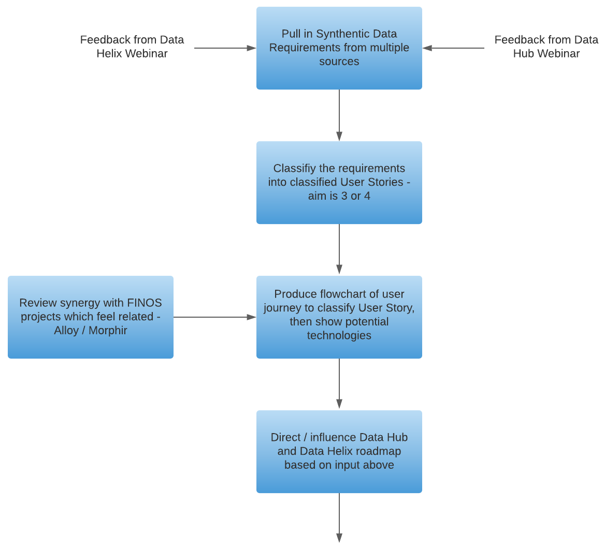

# Synthetic Data Approach for Gathering Requirements

The following diagram was presented to the FINOS community on 10th September 2020 and outlines the requirements gathering approach below.

### Requirements Gathering Approach

The following items describe the steps needed to gather the Synthetic Data requirements for DataHub and DataHelix.

1. Synthetic Data Requirements Obtained and Available in DataHub GitHub

2. Understand user stories of the clients who need a synthetic data solution or have a synthetic data problem.

3. Establish where the documentation should live and the relationship between projects

4. Contact FINOS project teams and understand their Synthetic Data requirements. The first project being [Morphir](https://github.com/finos/morphir) and then [Alloy](https://github.com/finos/alloy).

5. Direct / Influence DataHub and DataHelix roadmap based on input from the team.

### Delegated Action Groups and GitHub Issues

The outcomes of the requirements gathering exercise can be found in the [Delegated Action Groups](https://github.com/finos/datahub/tree/master/docs/delegated-action-groups) and [DataHub GitHub Issues](https://github.com/finos/datahub/issues).